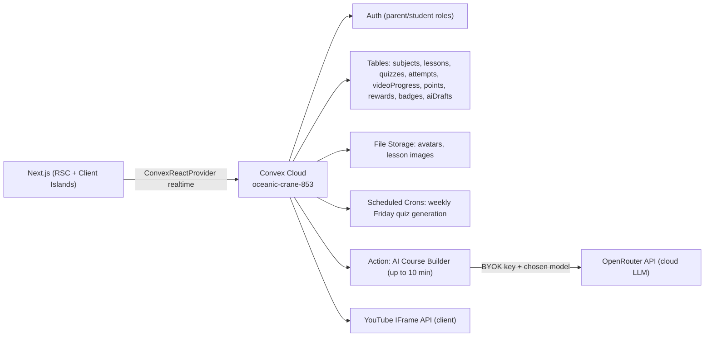
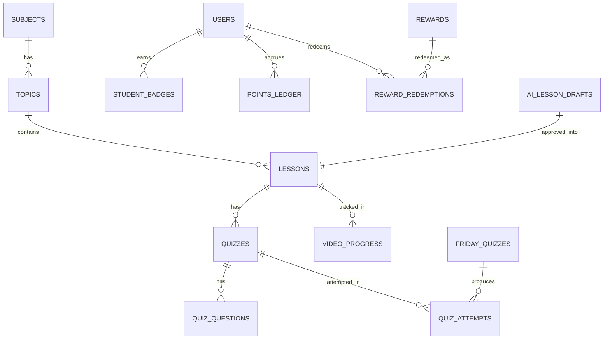

# HomeschoolHero — Implementation Plan

## Goal

A permanently-live, cloud-backed, gamified homeschool platform with a student portal (video lessons, quizzes, points, badges, Friday quiz, reward shop) and a parent admin dashboard (progress tracking, manual + AI lesson builder, reward shop manager, CSV/JSON export). Single-student MVP, role-based access, real-time data via Convex.

---

## Recommended Tech Stack

- **Framework**: Next.js 16 (App Router, RSC-first) + TypeScript
- **Styling**: Tailwind CSS + `tailwind.config.ts` — theme tokens defined per `[.cursor/skills/design/SKILL.md](.cursor/skills/design/SKILL.md)` (dark space theme, subject colours, glass cards, glow effects)
- **Components**: shadcn/ui (kebab-case file names, e.g. `lesson-card.tsx`)
- **Backend**: Convex (database, auth, storage, realtime, scheduled cron for Friday quizzes)
- **Auth**: Convex Auth (or `@convex-dev/auth`) with role-based access (`parent` / `student`)
- **Video**: YouTube IFrame Player API (per-second progress, resume-from-timestamp)
- **Animation**: Framer Motion (staggered orchestration, confetti, level-ups)
- **Charts**: Recharts (parent analytics)
- **Export**: Server-side CSV + JSON generators streamed from a Convex action
- **AI**: OpenRouter (BYOK) via a Convex `action` (up to 10-minute runtime — no timeout risk). OpenAI-compatible Chat Completions API at `https://openrouter.ai/api/v1`. Parent supplies their own API key and picks any cloud model from the [OpenRouter catalogue](https://openrouter.ai/models) (e.g. `openai/gpt-4o-mini`, `anthropic/claude-3.5-sonnet`, `google/gemini-flash-1.5`). Key stored server-side in Convex, never exposed to the browser.
- **Hosting**: Vercel (always-on, never sleeps) with Convex Cloud

---

## Design System & UI Standards

**Mandatory reference for all UI work.** Before building or styling any page or component, read and follow:


| Resource            | Path                                                                                                     | Purpose                                                            |
| ------------------- | -------------------------------------------------------------------------------------------------------- | ------------------------------------------------------------------ |
| Design skill        | `[.cursor/skills/design/SKILL.md](.cursor/skills/design/SKILL.md)`                                       | Theme tokens, component checklist, layout rules, Tailwind snippets |
| Dashboard wireframe | `[.cursor/skills/design/dashboard-layout.md](.cursor/skills/design/dashboard-layout.md)`                 | ASCII wireframe, grid proportions, z-index layers                  |
| Visual mockup       | `[ChatGPT Image Jun 18, 2026, 12_32_48 PM.png](ChatGPT%20Image%20Jun%2018,%202026,%2012_32_48%20PM.png)` | Source of truth for student dashboard look and feel                |


**Agent workflow**: invoke `@design` (or read the skill) whenever implementing student pages, parent pages, shared components, `tailwind.config.ts`, or `globals.css`. Do not use generic shadcn defaults without applying HomeschoolHero tokens.

**Student portal**: mirror the **exact layout** of the dashboard mockup — sidebar, header, 4 stat cards, middle row (missions / continue learning / Friday challenge), bottom row (progress / subjects / achievements / parent insights), footer widgets, FAB.

**Parent portal**: reuse the same design tokens (colours, radius, typography, card styles) but with a cleaner, data-dense admin layout — no mascot clutter.

**Phase 1 deliverable**: seed `tailwind.config.ts` and `app/globals.css` with tokens from the design skill before building any UI in Phase 3.

## Architecture Overview




### Folder structure (under repo root)

```text
/
├── app/
│   ├── (auth)/login/page.tsx
│   ├── (student)/
│   │   ├── layout.tsx
│   │   ├── dashboard/page.tsx
│   │   ├── subjects/[slug]/page.tsx
│   │   ├── lessons/[id]/page.tsx
│   │   ├── quiz/[id]/page.tsx
│   │   ├── friday-quiz/page.tsx
│   │   ├── rewards/page.tsx
│   │   ├── badges/page.tsx
│   │   └── review/page.tsx
│   ├── (parent)/
│   │   ├── layout.tsx
│   │   ├── dashboard/page.tsx
│   │   ├── courses/page.tsx          # course/subject manager
│   │   ├── courses/new/page.tsx      # manual full-course builder
│   │   ├── lessons/page.tsx
│   │   ├── lessons/new/page.tsx
│   │   ├── ai-builder/page.tsx       # AI course/lesson builder (prompt + draft review)
│   │   ├── rewards/page.tsx
│   │   ├── history/page.tsx
│   │   └── settings/page.tsx         # AI provider: OpenRouter key (BYOK) + model picker
│   └── layout.tsx
├── components/
│   ├── ui/                 # shadcn primitives
│   ├── student/
│   ├── parent/
│   └── shared/
├── convex/
│   ├── schema.ts
│   ├── auth.ts
│   ├── auth.config.ts
│   ├── subjects.ts
│   ├── lessons.ts
│   ├── quizzes.ts
│   ├── videoProgress.ts
│   ├── points.ts
│   ├── rewards.ts
│   ├── badges.ts
│   ├── fridayQuiz.ts
│   ├── aiCourseBuilder.ts            # action: generate full course/lesson drafts via OpenRouter
│   ├── settings.ts                   # store/read BYOK key + model selection (server-only)
│   ├── export.ts
│   └── crons.ts
├── lib/
│   ├── auth-guard.ts
│   ├── youtube.ts
│   └── export-formatters.ts
├── .cursor/skills/design/
│   ├── SKILL.md                      # design standards — read before any UI work
│   └── dashboard-layout.md           # student dashboard wireframe reference
└── .env.local
```

---

## Phase 1 — Project Foundation & Convex Wiring

**File touches**: new repo scaffold, `convex/`, `app/layout.tsx`, `.env.local`, `package.json`.

1. Scaffold Next.js 16 + TS + Tailwind: `npx create-next-app@latest . --ts --tailwind --app --eslint --import-alias "@/*"`.
2. Install deps:
  - `npm install convex @convex-dev/auth`
  - `npm install lucide-react framer-motion recharts`
  - `npx shadcn@latest init` then add `button card input label dialog drawer badge progress table tabs`.
3. Convex init to the **existing** deployment (do NOT create new):
  - `npx convex dev` → log in → select existing `dev/ryan-gliozzo` / slug `oceanic-crane-853`.
  - Confirms `convex/` folder, `convex/_generated/`, `.env.local`.
4. `.env.local`:

```bash
   NEXT_PUBLIC_CONVEX_URL="https://oceanic-crane-853.eu-west-1.convex.cloud"
   # Convex Auth site key added by `npx @convex-dev/auth dev`
   

```

1. Wire `ConvexProviderWithAuth` in [app/layout.tsx](app/layout.tsx) wrapping children; expose `Providers` client island.
2. Smoke test: add `convex/hello.ts` exporting `export const hello = query(() => "HomeschoolHero online");` and render it on the home page via `useQuery(api.hello.hello)`.
3. **Gate**: do not proceed until the smoke test prints live data.
4. Initialise `specs.md` (root) with the phase checklist and `.agent/memory.md` with architecture + next steps per house rules.
5. **Design foundation**: read `[.cursor/skills/design/SKILL.md](.cursor/skills/design/SKILL.md)` and apply theme tokens to `tailwind.config.ts` + `app/globals.css` (`bg-app`, subject colours, glass card utilities, glow shadows). No UI pages beyond smoke test until tokens are in place.

---

## Phase 2 — Core Data Model (Convex Schema)

Single file: [convex/schema.ts](convex/schema.ts). Tables (using `defineTable` + `v.`* validators):




Tables & key fields (roles enforced via Convex Auth `ctx.auth` in every query/mutation):

- `users`: `name`, `email`, `role` (`"parent" | "student"`), `avatarId?`, `createdAt`, `updatedAt`
- `subjects`: `name`, `slug`, `description`, `icon`, `color`, `order`, `active`
- `topics`: `subjectId`, `name`, `description`, `order`, `difficultyLevel`
- `lessons`: `subjectId`, `topicId`, `title`, `slug`, `description`, `lessonNotes`, `videoUrl`, `videoProvider` (`"youtube"`), `difficultyLevel`, `estimatedMinutes`, `pointsAwarded`, `status` (`"draft" | "published"`), `createdBy`, timestamps
- `quizzes`: `lessonId`, `subjectId`, `topicId`, `title`, `type` (`"lesson" | "friday"`), `difficultyLevel`, `pointsAwarded`
- `quizQuestions`: `quizId`, `questionText`, `questionType` (`"mcq" | "truefalse" | "ordering"`), `options`, `correctAnswer`, `explanation`, `difficultyLevel`, `order`
- `quizAttempts`: `userId`, `quizId`, `score`, `totalQuestions`, `correctAnswers`, `percentage`, `pointsEarned`, `completedAt`, `answers` (JSON of per-question results)
- `fridayQuizzes`: `weekStartDate`, `weekEndDate`, `title`, `questionIds[]`, `subjectsIncluded[]`, `doublePoints` (`true`), `status`
- `videoProgress`: `userId`, `lessonId`, `videoUrl`, `secondsWatched`, `lastTimestamp`, `percentageWatched`, `completed`, `updatedAt`
- `pointsLedger`: `userId`, `sourceType`, `sourceId`, `points`, `description`, `createdAt`
- `rewards`: `title`, `description`, `pointsCost`, `rewardType`, `active`, `createdBy`
- `rewardRedemptions`: `userId`, `rewardId`, `pointsSpent`, `status` (`"requested" | "approved" | "redeemed"`), timestamps
- `badges`: `title`, `description`, `icon`, `criteria`, `pointsBonus`, `active`
- `studentBadges`: `userId`, `badgeId`, `awardedAt`
- `aiLessonDrafts`: `requestedBy`, `prompt`, `subjectId`, `topicId`, `proposedTitle`, `proposedNotes`, `proposedVideoUrl`, `proposedQuizQuestions` (JSON), `difficultyLevel`, `status` (`"pending" | "approved" | "rejected"`), timestamps
- `aiCourseDrafts`: `requestedBy`, `prompt`, `model`, `proposedSubject` (`{ name, description, icon, color }`), `proposedTopics` (JSON array, each with `name`, `description`, `difficultyLevel`), `proposedLessons` (JSON array, each with `topicIndex`, `title`, `notes`, `videoUrl`, `difficultyLevel`, `pointsAwarded`, `quizQuestions[]`), `status` (`"pending" | "approved" | "rejected"`), timestamps. One draft can be approved into a full Subject + Topics + Lessons + Quizzes tree.
- `settings`: single parent-scoped doc — `openRouterModel` (e.g. `"openai/gpt-4o-mini"`), `openRouterKey` (BYOK key, **never returned to the client — client sees only `keyIsSet: boolean`**), `youtubeSearchEnabled`, `updatedAt`. Key is read exclusively inside Convex actions via internal query.

Indexes on every foreign-key column + `by_user_lesson` composite indexes on `videoProgress` and `quizAttempts`.

---

## Phase 3 — Student Portal MVP

**Design gate**: read `@design` skill (`[.cursor/skills/design/SKILL.md](.cursor/skills/design/SKILL.md)`) and wireframe (`[dashboard-layout.md](.cursor/skills/design/dashboard-layout.md)`) before writing any student UI. Compare finished dashboard against the verification checklist in the skill.

Client-island components under `components/student/` per the skill's component checklist; pages under `app/(student)/`.

- **App shell**: `student-sidebar.tsx` — logo, 8 nav items, profile card (avatar, name, rank, level, XP bar), 7-day streak tracker (exact spec in design skill)
- **Role guard**: `lib/auth-guard.ts` — server component wrapper that redirects non-`student` users.
- **Dashboard** [app/(student)/dashboard/page.tsx](app/(student)/dashboard/page.tsx): **mirror mockup layout exactly**:
  - Header: welcome + AI mascot speech bubble + diamond/star stats + bell + avatar
  - Top row: 4 stat cards (Points, Streak, Level, Weekly Goal)
  - Middle row: Today's Missions (4 subject cards) | Continue Learning hero | Friday Challenge countdown
  - Bottom row: Overall Progress donut | Core Subjects 2×4 grid | Recent Achievements | Parent Insights
  - Footer: Reward Shop strip | Need a Hint? card | floating star FAB
  - Wire all values to Convex queries; use mockup placeholder data only during initial layout pass
- **Subject overview** [subjects/[slug]/page.tsx](app/(student)/subjects/[slug]/page.tsx): topic list, per-lesson completion ticks; subject accent colour from design tokens
- **Lesson page** [lessons/[id]/page.tsx](app/(student)/lessons/[id]/page.tsx): RSC shell fetching lesson + videoProgress; client `<youtube-player>` island:
  - YouTube IFrame API; `setInterval(1s)` calls mutation `videoProgress:upsert` with `lastTimestamp`, `secondsWatched`, `percentageWatched`.
  - On load, `seekTo(lastTimestamp)` if exists.
  - "Mark complete" when `percentageWatched >= 90` OR end-of-video event.
- **Quiz page** [quiz/[id]/page.tsx](app/(student)/quiz/[id]/page.tsx): one question per screen, progress bar, immediate feedback + explanation, confetti on correct, score screen with points earned, retry option — styled per design skill (dark cards, encouraging copy, large answer buttons)
- **Reward shop** [rewards/page.tsx](app/(student)/rewards/page.tsx): grid of reward cards matching Reward Shop strip styling from dashboard; balance display, redeem button → `rewards:redeem` mutation
- **Empty / loading / error states** on every data view.

---

## Phase 4 — Parent Dashboard MVP

**Design gate**: reuse tokens from `@design` skill — same dark theme, card styles, subject colours — but admin-focused layout (no mascot, no gamification hero clutter). See "Parent Dashboard Adaptation" section in `[.cursor/skills/design/SKILL.md](.cursor/skills/design/SKILL.md)`.

Pages under `app/(parent)/`.

- **Dashboard** [app/(parent)/dashboard/page.tsx](app/(parent)/dashboard/page.tsx): Recharts charts (weekly watch time, average quiz score, lessons completed, streak, points earned, rewards redeemed, weak subjects).
- **Manual course builder** [courses/new/page.tsx](app/(parent)/courses/new/page.tsx): multi-step form to create a full course in one flow — Subject (name, icon, colour) → add multiple Topics → add Lessons per topic (title, description, YouTube URL, notes, difficulty, points) → quiz questions per lesson with correct answers + explanations. Saved transactionally via `courses:create` (creates `subjects` + `topics` + `lessons` + `quizzes` + `quizQuestions` together). Parent can save partial drafts (`status: "draft"`).
- **Manual lesson builder** [lessons/new/page.tsx](app/(parent)/lessons/new/page.tsx): single-lesson form (pick existing subject/topic, title, description, YouTube URL, notes, difficulty, points, quiz questions) → `lessons:create` + `quizzes:create` mutation, for adding a lesson to an existing course.
- **Reward manager** [rewards/page.tsx](app/(parent)/rewards/page.tsx): CRUD rewards; approve/redeem redemptions.
- **Export** [history/page.tsx](app/(parent)/history/page.tsx): "Download CSV" and "Download JSON" buttons → Convex `action` aggregates lessons completed, quiz scores, Friday results, watch time, points, redemptions, subject progress. Parent-only; permission check inside action.

---

## Phase 5 — Friday Quiz System

- **Cron** [convex/crons.ts](convex/crons.ts): every Monday 00:05 generate a `fridayQuizzes` doc for the upcoming Friday (Monday-Sunday week) by sampling questions from lessons completed in the prior week across studied subjects.
- **Student UI** [friday-quiz/page.tsx](app/(student)/friday-quiz/page.tsx): purple-themed **Friday Challenge** card per design skill (matches dashboard middle-row widget); animated boss-level start screen; 10 questions, one per screen; double points via `pointsLedger` entries tagged `sourceType: "friday_quiz"` with `points * 2`.
- Results screen: score, strong/weak subjects, recommended review lessons, badge unlocks, save to `quizAttempts` + parent-visible Friday history view.

---

## Phase 6 — Adaptive Learning

- Track rolling average per-topic in `quizAttempts`.
- `quizzes:nextDifficulty` query returns the next quiz's difficulty tier based on recent performance.
- `<60%` triggers a sliding `<get-help-drawer>` (simpler explanation, step-by-step hints, easier practice questions, retry button) — styled as **Need a Hint?** card from design skill; client component in `components/student/get-help-drawer.tsx`.
- Recommended-review list on dashboard sourced from topics with avg `< 70%`.

---

## Phase 7 — AI Course & Lesson Builder (OpenRouter BYOK)

### Why Convex action, not a Next.js API route

Convex actions can run for **up to 10 minutes** — there is no Vercel-style timeout. A full-course generation call (subject + topics + lessons + quizzes) is safe to run as a single Convex action without chunking or background-job infrastructure. The browser stays connected reactively via `useQuery` on the draft table; when the action completes and writes the draft, the UI updates automatically.

### AI settings (BYOK)

- Parent-only [app/(parent)/settings/page.tsx](app/(parent)/settings/page.tsx) AI section: paste OpenRouter API key, pick a model from a curated dropdown (`openai/gpt-5.4-mini`, `anthropic/claude-3.7-sonnet`, `google/gemini-flash-3.5`, plus free-text for any other model), and a "Test connection" button.
- `settings:saveAiConfig` mutation writes the key to the `settings` table. Client-facing queries on `settings` return only `{ keyIsSet: boolean, model: string }` — the raw key is never returned. The action reads the key via an `internalQuery`.
- Alternative: set `OPENROUTER_API_KEY` as a Convex environment variable in the Convex dashboard instead of the in-app UI — both approaches work identically.

### AI builder flow

- Parent-only [app/(parent)/ai-builder/page.tsx](app/(parent)/ai-builder/page.tsx) with a prompt box and a mode toggle: **Full course** or **Single lesson**.
- Clicking "Generate" immediately writes a `status: "generating"` draft row and calls the Convex `action aiCourseBuilder:generate`. The UI subscribes to the draft via `useQuery` and shows a live "Generating…" state while the action runs.
- The action calls `https://openrouter.ai/api/v1/chat/completions` with `response_format: { type: "json_object" }` and a strict JSON schema in the system prompt:
  - **Full course**: returns a subject, array of topics, and for each topic an array of lessons (title, notes, YouTube search query, difficulty, points, 5 quiz questions with explanations). Saved to `aiCourseDrafts`.
  - **Single lesson**: returns one lesson + quiz. Saved to `aiLessonDrafts`.
- YouTube video suggestions: the LLM provides a search query string. If a YouTube Data API key is set (`youtubeSearchEnabled: true` in settings), the action resolves it to a real video URL. Otherwise the parent confirms or replaces the URL during review.
- **Approval UI**: parent reviews the draft inline (editable fields for all content, add/remove/reorder topics and lessons), then clicks Approve:
  - `aiCourseDrafts:approve` transactionally creates `subjects` + `topics` + `lessons` + `quizzes` + `quizQuestions` and marks the draft `approved`.
  - `aiLessonDrafts:approve` creates a single `lessons` + `quizzes` + `quizQuestions`.
- Student queries always filter `status: "published"` — nothing AI-generated is visible to the student until a parent approves it.
- Errors (missing key, model error, rate limit, malformed JSON) surface as friendly messages in the builder UI; the draft row is updated to `status: "failed"` with an error message so the parent can retry.

---

## Phase 8 — Premium UI & Gamification

**Design gate**: all polish must extend patterns already defined in `@design` skill — do not introduce conflicting styles.

- **Animations** (per design skill Motion section): Framer Motion staggered card reveals, progress rings, confetti on quiz success, level-up screens, badge unlock toasts, animated subject cards, reward-shop purchase animation
- **Interactive learning objects**: clickable timelines (History), drag-and-drop event ordering, tap-to-reveal hints, simple science/CS simulations — use subject accent colours and glass card styling throughout
- **Badges engine** [convex/badges.ts](convex/badges.ts): scheduled check after each `quizAttempt` / lesson completion evaluates badge `criteria` and awards new `studentBadges` + bonus points; badge icons match **Recent Achievements** row styling from mockup
- **Dashboard verification**: run checklist at bottom of `[.cursor/skills/design/SKILL.md](.cursor/skills/design/SKILL.md)` against live student dashboard before marking phase complete

---

## Phase 9 — Security, Testing, Polish

- **RBAC**: every Convex function asserts `ctx.auth.getUserIdentity()` + role; frontend route groups `(student)` / `(parent)` protected by `lib/auth-guard.ts`. Sensitive writes (lesson create, reward CRUD, export, AI) parent-only and re-checked server-side.
- **Validation**: Convex `v.`* validators on all inputs + manual checks (e.g. can't redeem without sufficient balance).
- **Tests**: Playwright smoke tests (login, watch video, complete quiz, redeem reward, parent export) + Vitest unit tests for points math and Friday quiz generation.
- **Polish**: mobile layouts per design skill breakpoints, skeleton loaders, empty states, error boundaries, optimistic updates
- **Design QA**: student dashboard matches mockup; parent portal uses same tokens; no unstyled shadcn defaults
- **Docs**: `specs.md` checklist ticked off, `README.md` updated with local dev + Convex env setup + link to design skill

---

## Curriculum Content (seeded in Phase 2 via a `seed.ts` one-off script)

Subjects seeded with starter units (each unit → topics → sample lessons flagged `draft` for parent to review):

- **Maths**: Fractions, Ratios, Basic Algebra, Problem Solving, plus Decimals, Percentages, Geometry, Measurements, Negative Numbers, Statistics, Graphs, Word Problems, Mental Maths, Times-tables fluency, Area/Perimeter/Volume, Coordinates, Angles, Time & Money.
- **English**: Grammar, Sentence Structure, Reading Comprehension, Vocabulary, Writing, plus Punctuation, Paragraphs, Persuasive Writing, Creative Writing, Summarising, Inference, Non-fiction, Story Structure, Editing, Spelling Patterns, Planning, Tone, Comparing Texts, Explanations.
- **Science**: Human Body, Electricity, States of Matter, plus Forces, Light, Sound, Space, Plants, Animals, Ecosystems, Materials, Scientific Method, Fair Testing, Data Recording, Predictions, Observations, Home Experiments, Drawing Conclusions, Safety.
- **History**: WWI, WWII, American Founding & Revolution, War of 1812, American Civil War (each with the sub-topics listed in the brief). Tone age-appropriate and respectful on Holocaust, slavery, Blitz. Plus source analysis, cause/effect, chronology, bias, primary/secondary sources, geography of conflict, propaganda, modern-world connections.
- **AI & Computer Science**: Prompts, Logic, Logic Gates, Binary, Problem-Solving, Safe AI Use, plus Algorithms, I/O, Variables, Conditionals, Loops, Debugging, Data, Internet Safety, AI Limitations, Prompt Improvement, Pattern Recognition, Simple Encryption, Flowcharts.
- **Game Development**: Game Loops, Coordinates, Game Logic, Coding, Character Movement, Rules/Scoring/Levels, plus Sprites, Collision, Controls, Health, Timers, Win Conditions, Events, Animation, SFX, 2D Design, Menus, Obstacles, Scoreboards, Testing.
- **Homemaking**: Cooking Basics, Kitchen Safety, Recipes, Cleaning Routines, Appliance Safety, plus Meal Planning, Nutrition, Food Storage, Laundry, Folding, Cleaning Schedules, Organisation, Budgeting, Home Safety, Routines, Labels, Measuring, Knife Handling (supervised), Expiry Dates, Chore Planning.
- **Building & Construction**: Blueprints, Scale, Measuring, Construction Basics, Hand-Tool Mechanics, plus Materials, Accurate Measuring, Angles, Levels, Structures, Load & Stability, Tool Safety, Project Planning, Diagrams, DIY Projects, Estimating, Joins & Fixings, Plans, Workspace Setup, Quality Review.

---

## MVP Definition of Done (Phases 1-5 minimal)

- Convex connection live, smoke query renders.
- Parent + student accounts exist with role enforcement.
- Subjects + seed lessons visible to student.
- YouTube lessons track watch time and resume.
- Quizzes score + award points.
- Reward shop redeem works.
- Friday quiz generates weekly and awards double points.
- Parent sees real-time progress + can export CSV/JSON.
- Student dashboard layout matches design mockup (verified via design skill checklist).
- Deployed to Vercel (always-on).

---

## Future (post-MVP)

AI tutor chat with parent controls, voice quiz answers, printable worksheets, weekly parent email reports, avatar customisation, custom learning paths, mastery levels, unit exams, science experiment logs, history timeline builder, game-dev project gallery, homemaking checklist tracker, construction project planner, calendar-based lesson planning, multi-student support, mobile app, offline printable backup packs, support for additional cloud AI providers (Anthropic direct, Google Gemini direct, etc.).