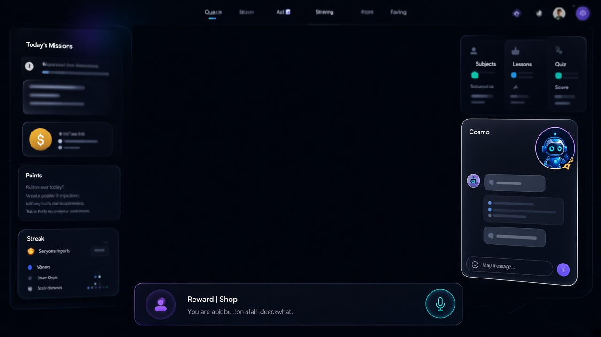
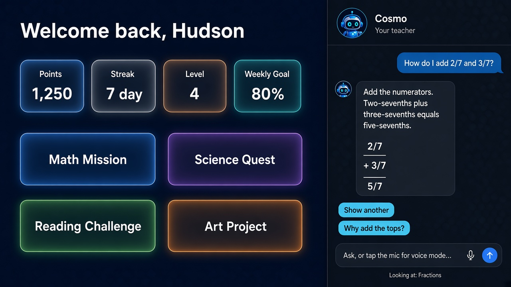
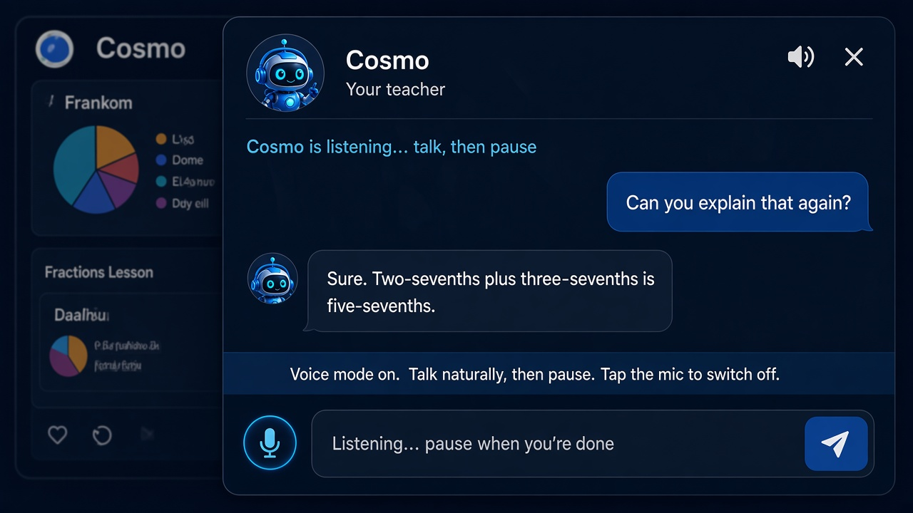

# Building a Gamified Homeschooling App with GLM 5.2 — Part 4: Cosmo, the AI Teacher

September 27, 2026
9 min read

Ryan Gliozzo
Digital Marketing Expert
homeschool hero webapp build with glm 5.2
Project status: Cosmo, an in-app AI teacher, is live on every student page — chat, voice in, voice out. A parent video page, one shared rule for finishing a lesson, reward editing, and a login fix shipped in the same stretch.

> Catch up: [Part 1](#) planned the product, [Part 2](2026-06-19-part-2-foundation-data-model-dashboard.md) shipped the foundation and the student dashboard, and [Part 3](2026-06-19-part-3-parent-console-and-friday-challenge.md) shipped the parent console and the Friday Challenge. This post is about the feature my son has been asking for since we started — a teacher he can talk to when he gets stuck.

---

## A Teacher on the Page

The AI lesson builder we planned back in Part 1 is now a proper parent tool. I type a topic, it drafts a full course with notes, a video suggestion, and quiz questions, and nothing reaches my son until I approve it. But that tool is for me. What my son kept asking for was something different. When he is stuck halfway through a fractions lesson, he does not want to come and find me every time, and he does not want a search box either. He wants someone to ask, right there on the page he is already on.

So that is what we built. Cosmo is the little blue robot from the dashboard, and he now sits in the corner of every student page, positioned away from the rewards button so the two never fight for space. Tap him and a glass chat panel slides in over the page. The rest of the dashboard stays where it is. He can see what lesson my son is on, he answers in plain English, and if my son wants, he will read the answer out loud.

The architecture decision is the same one behind the lesson builder. The browser never talks to the model provider. The chat, the transcription, and the speech all run as Convex actions on the backend, and the OpenRouter key lives in parent settings where my son cannot reach it. He cannot change the models and he cannot see the key, because there is no code path that lets him.

Figure 1: Cosmo open on the dashboard. The question is about sevenths, and the fraction comes back drawn as a proper stack rather than LaTeX.

---

## Step 1: Chat That Knows the Page

The first decision was about storage, and it was deliberate. Cosmo's conversations are session-only. There is no messages table. When my son closes the panel, the thread is gone. I did not want a growing archive of everything a child typed sitting in a database, and I could not think of a good reason to keep one.

What Cosmo does receive is a small snapshot of the page my son is on. On a lesson, that is the title and the subject. On the dashboard, today's missions. On a quiz, the question he is looking at. It never sends the full lesson body, and it never sends the correct answer. A hint that contains the answer is not a hint, so the answer simply is not part of the request.

The model can call a short allowlist of tools when it needs more context: what is on today's calendar, what is on this week, progress per topic as a percentage, and recent quiz titles with scores. It gets two rounds of tool calls, then it has to answer. The system prompt tells it to hint first, keep explanations at the level of a twelve-year-old, and not to lecture.

Replies come back as Markdown, and the first version of the chat bubbles printed the asterisks and dashes as raw characters, which looks broken to anyone, let alone a child. We built a small renderer that handles bold, lists, and the rest properly, and replies that arrive half paragraph and half list get split into real lists before they render. Under the thread there are suggestion chips like "Show another" or "Why do we add the tops?", so he can keep going without having to think of the next question himself.

---

## Step 2: Maths He Can Read and Hear

The first time Cosmo read a fraction out loud, he said "backslash frac two seven". The model had written \frac{2}{7}, and the speech engine faithfully read out the source code.

We fixed it at three layers, because the prompt alone did not feel like enough of a guarantee:

| Layer | What it does | What my son gets |
| --- | --- | --- |
| **Display** | The chat renders fractions as a proper stack, numerator over a bar over the denominator, using CSS. | `2/7 + 3/7 = 5/7` looks like a fraction, not LaTeX. |
| **Speech** | Before any audio request, a rewrite step turns `\frac{2}{7}` and `2/7` into "two sevenths". Plus becomes "plus", equals becomes "equals". | He hears a normal sentence, not symbols spelled out. |
| **Prompt** | The teacher prompt forbids LaTeX and dollar signs in replies. | New replies are less likely to need the rewrite at all. |

The prompt is a request to the model. The rewrite is the part that actually guarantees it. If a model still emits LaTeX on a bad day, the speaker never sees it.

---

## Step 3: Voice Mode

The first version of voice was push-to-talk. You held the mic, a transcript dropped into the input, and then you pressed send. That is dictation rather than a conversation, so we rebuilt it.

Voice mode is a toggle. The mic stays on. Cosmo listens, and when my son stops talking for about a second, the recording goes up, gets transcribed, and sends itself. The text is never left sitting in the input waiting for a click. When Cosmo finishes speaking, he starts listening again, unless voice mode has been switched off.

He also does not listen while he is talking. If he could hear his own reply, he would try to answer it.

Figure 2: Voice mode on. The banner tells him to talk, then pause. The mic button is the toggle — tap it again and he goes back to typing.

A few things we only learned by actually using it:

- Turning voice mode on unmutes him. Muted and listening at the same time felt like a broken phone call.
- The silence detector and the send function raced each other, and the transcript kept landing in the input instead of going out. The fix was to send from the recording result itself, rather than from a flag that still claimed we were listening.
- Recordings are not stored anywhere. The action transcribes the audio and drops it.

Speech-to-text is Whisper, running through the same server action. Spoken replies are on by default, and my son can mute them in the panel without turning Cosmo off.

---

## Step 4: Choosing the Voice

Parent settings gained a Cosmo section: presets (Recommended, Budget, Higher quality), catalogue pickers for the chat, speech-to-text, and text-to-speech models, and a voice dropdown with a Preview button that plays one line so you can hear who you are picking before you commit.

The preview did not work at first. Every voice in the list sounded like the same man.

The logs explained it. OpenRouter returned a 400: the OpenAI TTS model id we had saved does not exist on their catalogue. We had taken the id from documentation, saved it, and every voice request since had failed quietly. The fallback then spoke with the same Kokoro voice every time, so the picker changed and the audio did not. That is an awkward kind of bug, because nothing in the UI ever looks broken.

The fix was to trust the live catalogue rather than any documented id. Recommended speech is now Kokoro (`hexgrad/kokoro-82m`) with Emma as the default voice, and Higher quality uses Gemini Flash TTS. The old OpenAI voice names are remapped onto Kokoro voices, and a one-time settings patch rewrote the stored model id so nobody stayed stuck on the dead one. Previewing Emma, then George, then Isabella now gives three clearly different people. One catch worth knowing: preview does not change what my son hears. You have to save after you pick.

On privacy, chat still prefers a zero-data-retention provider when the endpoint allows it, and retries without that flag if the provider rejects it. Not every speech model offers that promise, and the settings page says so plainly. Either way, we do not store chats or recordings, and the prompt tells Cosmo never to ask for personal details, addresses, or anything else a family should keep off a third-party model.

---

## What Else Shipped in the Same Stretch

Cosmo was the headline, but a batch of parent-side fixes went out with him. These are the kind of things you only notice when the number on the screen is wrong.

| Fix | What was wrong | What it does now |
| --- | --- | --- |
| **One definition of "done"** | A lesson could count as complete in one place and not another. | A lesson is complete if the video reached about 90 percent watched, the quiz was passed, the interactive was finished, or I marked it myself. The progress page, the calendar chips, and the weekly goal on the dashboard all use that one rule. |
| **Video watch page** | Watch data was buried in the dashboard. | `/parent/videos` charts percent watched, finished versus still in progress, and minutes by subject, plus the full table. The dashboard "videos finished" stat links to it. |
| **YouTube player tracking** | Rewinding a video could erase progress. | The player now reports duration, keeps the farthest point reached, and only writes while the video is actually playing. |
| **Reward editing** | The points cost field never wrote back. | Edit now patches the title, description, and cost, so repricing "extra screen time" actually reaches the shop. |
| **First sign-in hang** | Family sign-in sat on "Unlocking…" until a manual refresh. | After sign-in we navigate with a full page load, so the next screen starts with a client that already has the session. |

One change under the hood is worth mentioning too. List queries stopped dragging full lesson bodies around. Lesson text now lives in its own table and only loads when you open the lesson, while dashboards, calendars, and sidebars read the slim rows. You cannot see this in the UI, but you can see it on the Convex bill.

---

## What Tripped Us Up

The speech bug is the one I would pass on to anyone wiring text-to-speech through a router. A model id in a blog post or a docs snippet is not a promise; the catalogue is. We trusted a slug, saved it, and then built a fallback polite enough to hide the failure by always speaking with the same voice. "All the voices sound the same" is much harder to debug than "this voice failed", because nothing ever looks broken.

The second was the listening race. Voice mode looked finished, because the transcript appeared. It was not finished, because sending was still a manual step, caused by a stale "still listening" check. The fix was to treat the pause itself as the send action. As long as sending was a separate step, it was not really a conversation.

The third was smaller and more embarrassing. Login felt instant the second time and frozen the first time, which is exactly what a half-updated websocket does. A manual refresh was masking the problem. A navigation that creates a fresh client does not.

---

## Where We Are Now

- Cosmo is on every student page, with a session-only chat that can see the page and cannot see quiz answers.
- Replies render as Markdown, with real lists and stacked fractions.
- Spoken maths is English. He does not read LaTeX out loud.
- Voice mode listens, sends on a pause, and listens again after he finishes talking.
- Parent settings pick the chat model, the speech models, and the voice, and Preview plays the real thing.
- A lesson is complete from the video, the quiz, the interactive, or a parent mark, and the video page shows the full watch log.
- Reward edits save properly, and first sign-in leaves the login screen without a refresh.

The loop from the earlier posts is unchanged. I still approve every lesson before my son sees it. Cosmo does not publish curriculum. He helps with the lesson that is already there.

---

## What Comes Next

Chats disappear when the panel closes, and that is still the right default, but a saved history with a clear delete button is the obvious next step if he wants to come back to a thread. The daily request cap is stored but not enforced yet. And if the pause-and-reply rhythm still feels like a walkie-talkie, the experiment after that is a realtime voice session instead of record, transcribe, chat, then speak.

The takeaway from this stage is the same one as the lesson builder, pointed at a different user. The model is the easy part. The useful part is everything around it — server-only keys, a page context that leaves the answers out, a speech path that survives a dead model id, and a microphone that behaves like a conversation.

---

*This is the fourth in a series of five posts. We will keep updating as each phase ships.*
